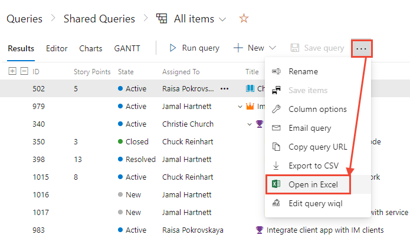
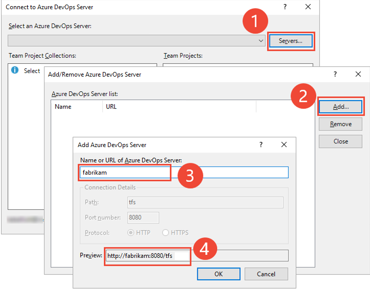
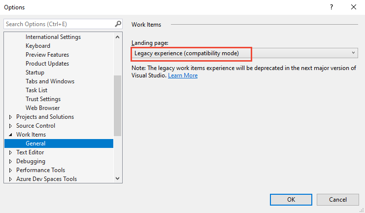
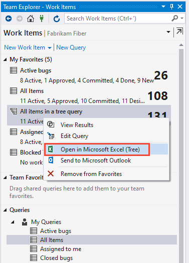

# Connect Azure Boards to an Office client 

[!INCLUDE [temp](../../includes/version-all.md)]

::: moniker range=">= azure-devops-2019"

To support your work tracking efforts, you can use Microsoft Excel. You can decide to either work in an online mode where you are connected to either Azure Boards or Azure DevOps Server, or in an offline mode where you access the local computer and document. 

::: moniker-end

::: moniker range="<= tfs-2018"

To support your work tracking efforts, you can use Microsoft Excel and Microsoft Project. You can decide to either work in an online mode where you are connected to either Azure Boards or Team Foundation Server (TFS), or in an offline mode where you access the local computer and document. 

::: moniker-end

> [!IMPORTANT]  
> All Office integration tasks require that you have installed a version of Visual Studio or the free [Azure DevOps Office Integration 2019](https://visualstudio.microsoft.com/downloads/#other-family).

In this article you'll learn about the following items: 

> [!div class="checklist"]    
> * Which Office clients support connection to Azure DevOps
> * Prerequisites for connecting from an Office client to Azure DevOps
> * Importance of publishing and refreshing work from an Office client
> * How to connect Excel to an Azure Boards project 
> * How to work offline and reconnect to Azure DevOps 
> * Marketplace extensions that support integration with Office clients 

## Supported Office clients and Azure DevOps versions 

The following table indicates the Office clients that are supported for each Azure DevOps version starting with Team Foundation Server 2013 (TFS 2013). 

> [!NOTE]  
> macOS isn't supported. Even if you've installed Visual Studio for Mac, connection to Azure DevOps from Excel or any other Office client isn't supported.  

---

:::row:::
   :::column span="2":::
      **Azure DevOps/Visual Studio version**
   :::column-end:::
   :::column span="":::
      **Excel**
   :::column-end:::
   :::column span="":::
      **Project**1
   :::column-end:::
   :::column span="":::
      **PowerPoint Storyboarding**2
   :::column-end:::
:::row-end:::
:::row:::
   :::column span="2":::
      Azure DevOps Services  
      Azure DevOps Server 2020  
      Azure DevOps Server 2019  
      Visual Studio 2019  
      Azure DevOps Office Integration 2019 
   :::column-end:::
   :::column span="":::
      ✔️  
   :::column-end:::
   :::column span="":::
        
   :::column-end:::
   :::column span="":::
         
   :::column-end:::
:::row-end:::
:::row:::
   :::column span="2":::
      TFS 2018  
      TFS 2017  
      Visual Studio 2017  
   :::column-end:::
   :::column span="":::
      ✔️  
   :::column-end:::
   :::column span="":::
      ✔️  
   :::column-end:::
   :::column span="":::
      ✔️  
   :::column-end:::
:::row-end:::
:::row:::
   :::column span="2":::
      TFS 2015  
      TFS 2013  
      Visual Studio 2015  
      Visual Studio 2013  
   :::column-end:::
   :::column span="":::
      ✔️  
   :::column-end:::
   :::column span="":::
      ✔️  
   :::column-end:::
   :::column span="":::
      ✔️  
   :::column-end:::
:::row-end:::

#### Notes: 
1.  Support for Project integration and the **TFSFieldMapping** command have been deprecated for Azure DevOps Server 2019 and later versions. You may find support using one of the [Marketplace extensions](#marketplace). 
2.  Support for linking PowerPoint files to work items from within PowerPoint has been deprecated starting with Visual Studio 2019 and  Azure DevOps Office Integration 2019. You can still link to PowerPoint using the Storyboard link from within a work item. Also, the Visual Studio Gallery for PowerPoint Storyboarding has been deprecated.  
 

## Prerequisites 

Connection from an Office client to an Azure Boards project requires that you have installed the necessary software and have the necessary permissions. 

::: moniker range="azure-devops" 

- To connect Excel to Azure Boards, you must have installed Office Excel 2010 or later version, including Office Excel 365. 
- Installed [Azure DevOps Office Integration 2019 (free)](https://visualstudio.microsoft.com/downloads/#other-family).
	> [!NOTE]   
	> The only way to get the Azure DevOps Office Integration plug-in is by installing one of the latest editions of Visual Studio or the Azure DevOps Office Integration installer. The plug-in supports connection to Azure Boards and Azure DevOps Server from Excel.  
- To connect to an Azure Boards project, you need to be a [member of the project](../../../organizations/security/add-users-team-project.md). If you don't have an Azure Boards project yet, you can [create one](../../get-started/sign-up-invite-teammates.md).  

::: moniker-end  

::: moniker range=">= azure-devops-2019 < azure-devops" 

- To connect Excel to Azure Boards, you must have installed Office Excel 2010 or later version, including Office Excel 365. 
- Installed [Azure DevOps Office Integration 2019 (free)](https://visualstudio.microsoft.com/downloads/#other-family).
	> [!NOTE]   
	> The only way to get the Team Foundation plug-in is by installing one of the latest editions of Visual Studio or the TFS Standalone Office Integration installer. The TFS Office Integration 2017 plug-in supports connection to Azure Boards and TFS from Excel, Project, and the PowerPoint-based storyboarding tool.
- To connect to an Azure Boards project, you need to be a [member of the project](../../../organizations/security/add-users-team-project.md). If you don't have an Azure Boards project yet, you can [create one](../../../organizations/projects/create-project.md). 

::: moniker-end  

::: moniker range=">= tfs-2017 <= tfs-2018" 

- To connect Excel to Azure Boards, you must have installed Office Excel 2010 or later version, including Office Excel 365. 
- To connect Project to Azure Boards, you must have installed Office Project 2010 or later version, including Office Project 365. 
- To connect PowerPoint to Azure Boards, you must have installed [Office PowerPoint 2010 or later version installed](https://www.microsoftstore.com/store/msusa/en_US/pdp/productID.323024400). If you're interfacing with TFS 2013 or TFS 2015, you must have Office PowerPoint 2007 or later version installed. 
- Installed Visual Studio 2013 or later version or [Team Foundation Server Standalone Office Integration (free)](https://visualstudio.microsoft.com/downloads#team-foundation-server-office-integration-2017)
	> [!NOTE]   
	> The only way to get the Team Foundation plug-in is by installing one of the latest editions of Visual Studio or the TFS Standalone Office Integration installer. The TFS Office Integration 2017 plug-in supports connection to Azure Boards and TFS from Excel, Project, and the PowerPoint-based storyboarding tool.
- To connect to an Azure Boards project, you need to be a [member of the project](../../../organizations/security/add-users-team-project.md). If you don't have an Azure Boards project yet, you can [create one](../../../organizations/projects/create-project.md). 

::: moniker-end  

::: moniker range=">= tfs-2013 <= tfs-2015" 

- To connect Excel to Azure Boards, you must have installed Office Excel 2007 or later version. 
- To connect Project to Azure Boards, you must have installed Office Project 2007 or later version. 
- To connect PowerPoint to Azure Boards, you must have installed [Office PowerPoint 2010 or later version installed](https://www.microsoftstore.com/store/msusa/en_US/pdp/productID.323024400). If you're interfacing with TFS 2013 or TFS 2015, you must have Office PowerPoint 2007 or later version installed. 
- Installed Visual Studio 2013 or later version or [Team Foundation Server Standalone Office Integration (free)](https://visualstudio.microsoft.com/downloads#team-foundation-server-office-integration-2017)
	> [!NOTE]   
	> The only way to get the Team Foundation plug-in is by installing one of the latest editions of Visual Studio or the TFS Standalone Office Integration installer. The TFS Office Integration 2017 plug-in supports connection to Azure Boards and TFS from Excel, Project, and the PowerPoint-based storyboarding tool.
- To connect to an Azure Boards project, you need to be a [member of the project](../../../organizations/security/add-users-team-project.md). If you don't have an Azure Boards project yet, you can [create one](../../../organizations/projects/create-project.md). 

::: moniker-end  
 

To learn more about compatibility requirements, see [Compatibility with Azure DevOps](/azure/devops/server/compatibility). 

::: moniker range=">= azure-devops-2019" 

- Microsoft Excel 2010 or later version, including Microsoft Office Excel 365
- Visual Studio 2013 or later version or [Team Foundation Server Standalone Office Integration (free)](https://visualstudio.microsoft.com/downloads#team-foundation-server-office-integration-2017)
- [Permissions to connect to the project](../../../organizations/security/add-users-team-project.md) in Azure Boards. 

::: moniker-end  

::: moniker range=">= tfs-2017 <= tfs-2018" 

- Office Excel 2010 or later version, including Microsoft Office Excel 365
- Office Project 2010 or later version, including Office Project 365
- Visual Studio 2013 or later version or [Team Foundation Server Standalone Office Integration (free)](https://visualstudio.microsoft.com/downloads#team-foundation-server-office-integration-2017)
- [Permissions to connect to the project](../../../organizations/security/add-users-team-project.md) in Azure Boards or TFS. 

::: moniker-end  

::: moniker range=">= tfs-2013 <= tfs-2015" 

- Microsoft Excel 2007, Microsoft Excel 2010, or Microsoft Excel 2013
- Office Project 2007, Office Project 2010, or Office Project 2013
- Visual Studio 2013 or Visual Studio 2015 or [Team Foundation Server Standalone Office Integration (free)](https://visualstudio.microsoft.com/downloads#team-foundation-server-office-integration-2017)
- [Permissions to connect to the project](../../../organizations/security/add-users-team-project.md). 

::: moniker-end   

To learn more about compatibility requirements, see [Azure DevOps client compatibility](/azure/devops/server/compatibility). 

  
> [!IMPORTANT]  
> You may receive the following error if you install Microsoft Office 2010 on the same computer as a previous version of Office.  
>   
>  **Team Foundation Error**  
>   
>  **Interface not registered (Exception from HRESULT: 0x80040155)**  
>   
>  You may be able to resolve this error by repairing Office. You can access the Repair option by opening the **Control Panel**, choose **Uninstall or change a program**, open the context menu for Office 2010, and then choose **Change**. See also, [Azure DevOps-Office integration issues](tfs-office-integration-issues.md).  
  

## Publish and refresh work items

::: moniker range="> tfs-2018" 

When you add or update work items from Excel, local copies of your work items are created. To keep data in sync, its important to refresh your local file when you open it and publish and refresh frequently during a long online session. 

::: moniker-end  

::: moniker range="<= tfs-2018" 

When you add or update work items from Excel or Project, local copies of your work items are created. To keep data in sync, its important to refresh your local file when you open it and publish and refresh frequently during a long online session. 

::: moniker-end  

The data in the local document at first matches the data in the database, but you or other team members can change the data about work items and cause the two to differ. To view the most recent changes from the database, refresh the document. This downloads the latest values in the data store to your local document. To write changes from the document to the database, publish the changes. Publishing uploads the changes you made to the work item tracking data store.   

To keep work items in sync from your local data store and Azure Boards, publish and refresh often. 

### Azure DevOps and Excel

  

To work in Excel, see [Bulk add work items with Excel](bulk-add-modify-work-items-excel.md). 

## Connect Azure DevOps project to Excel  

::: moniker range="<= tfs-2018" 

> [!NOTE]  
> While this section illustrates how to connect Excel to an Azure Boards project, the steps for connecting from Project or PowerPoint are similar. 

::: moniker-end  

To add or modify work items by using Excel, you connect your worksheet to a project. Establishing this connection binds the document to the Azure DevOps project to exchange information. 

> [!NOTE]   
> When you connect to Azure Boards in the cloud, the **Team Project Collection** is automatically selected as their is only one collection associated with your Azure DevOps Services organization. When you connect to Azure Boards in an on-premises server, you choose the **Team Project Collection** prior to choosing the project.  

You can start work from the web portal, Excel, or Visual Studio/Team Explorer. Your worksheet is associated with either a list of work items or a work item query.  

#### [Open query in Excel (web portal)](#tab/open-excel) 

This connection method requires that you have installed [Azure DevOps Open in Excel](https://marketplace.visualstudio.com/items?itemName=blueprint.vsts-open-work-items-in-excel). It also requires Visual Studio 2017 or later version. 

1. From your web browser, (1) check that you have selected the right project, (2) choose **Boards>Queries**, and then (3) choose **All**. 
 
	> [!div class="mx-imgBorder"]  
	>  

2. Choose the query you want to open in Excel. 

3. From the **Results** tab, choose the  :::image type="icon" source="../../media/icons/actions-icon.png" border="false"::: actions icon

	> [!div class="mx-imgBorder"]  
	>  

#### [Connect from client to Azure Boards](#tab/open-excel-cloud) 

To connect from your Office client to an Azure DevOps Services project, perform the following steps.  

1.  Start with a blank worksheet. 

1.  If you're client is signed into a user account, make sure that it is your Azure DevOps user account. If not, choose your account name and sign in as another user.  

	> [!div class="mx-imgBorder"]  
	> 

1.  If you don't see the **Team** ribbon (or the **Team** menu if you use Office 2007), see [Azure DevOps Office integration issues](tfs-office-integration-issues.md). 

1. Choose the **Team** tab, place your cursor in Cell A1, and then choose **New List**.  

	

1.	The Connect to Azure DevOps Server dialog opens. 

	> [!div class="mx-imgBorder"]  
	> 

	If you are signed-in to your Office client with your Azure DevOps user account, then the set of servers, both cloud and on-premises, you have access to is automatically populated in the drop-down menu. 

	If you're not signed-in or you're working from an older version of an Office client, and you haven't connected to any servers previously, you need to add them now. 

1. Add a server to connect to. 

	(1) Choose **Servers...**, (2) choose **Add...**, (3) enter the URL of your Azure Boards organization, and (4) check that the preview matches the URL that you entered. Then choose **OK**. 

	

	If you can't connect, [get added as a team member](../../../organizations/security/add-users-team-project.md#add-team-members).  
4.  With the server selected, choose the project you want to connect to, and then choose **Connect**. 

	> [!div class="mx-imgBorder"]  
	> 

	Make sure your Azure DevOps user account appears at the bottom of the dialog. If it isn't, choose **Switch User** and sign in to the correct account.  

5. From the New List dialog, choose **Input list**. Or, if you want to work with a list of work items defined in a query, choose **Query list**.

    

#### [Connect client to Azure DevOps on-premises](#tab/open-excel-on-prem) 

To connect from your Office client to an Azure DevOps Server project, perform the following steps.  

1.  Start with a blank worksheet. 

1.  If you're client is signed into a user account, make sure that it is your Azure DevOps account. If not, choose your account name and sign in as another user.  

	> [!div class="mx-imgBorder"]  
	> 

1.  If you don't see the **Team** ribbon (or the **Team** menu if you use Office 2007), see [Azure DevOps-Office integration issues](tfs-office-integration-issues.md). 

1. Choose the **Team** tab, place your cursor in Cell A1, and then choose **New List**.  

	

1.	The Connect to Azure DevOps Server dialog opens. 

	> [!div class="mx-imgBorder"]  
	> 

	If you are signed-in to your Office client with your Azure DevOps user account, then the set of servers, both cloud and on-premises, you have access to is automatically populated in the drop-down menu. 

	If you're not signed-in or you're working from an older version of an Office client, and you haven't connected to any servers previously, you need to add them now. 

1. Add a server to connect to. 

	(1) Choose **Servers...**, (2) choose **Add...**, (3) enter the name of your Azure DevOps Server instance. As needed, change the Port number if your deployment uses a non-default port number. The Preview entry should display the correct URL for your deployment. (4) Choose **OK**.  

    

	Choose **Close** to close the Add/Remove servers dialog. From the Select an Azure DevOps Server dialog, make sure the server you added is selected, and then choose **Connect**. 

	If you can't connect, [get added as a team member](../../../organizations/security/add-users-team-project.md#add-team-members).  
4.  With the server selected, choose the project you want to connect to, and then choose **Connect**. 

	> [!div class="mx-imgBorder"]  
	> 

	Make sure your Azure DevOps user account appears at the bottom of the dialog. If it isn't, choose **Switch User** and sign in to the correct account.  

5. From the New List dialog, choose **Input list**. Or, if you want to work with a list of work items defined in a query, choose **Query list**.

    

#### [Open Excel from Visual Studio](#tab/open-excel-vs) 

1. Open Visual Studio and then Team Explorer. 

	> [!IMPORTANT]  
	> To work from Visual Studio 2019/Team Explorer, you need to select the  **Tools>Options>Work Items>General** Legacy experience. For more information, see [Set the Work Items experience in Visual Studio 2019](../../work-items/set-work-item-experience-vs.md).  
	>  
	> [!div class="mx-imgBorder"]  
	> 

2. Connect to your Azure DevOps project that contains the work items you want to add to or update. For more information, see [Connect to a project](../../../organizations/projects/connect-to-projects.md).

3.  Right-click the query you want to open and choose. 

	> [!div class="mx-imgBorder"]  
	> 

	Excel opens with the work items listed in the query you selected. 

*** 

To learn more, see [Bulk add work items with Excel](bulk-add-modify-work-items-excel.md). 

> [!TIP]    
> You can use multiple worksheets within an Excel workbook to work with different input or query lists. However, you can only connect to one project per workbook.

::: moniker range="< azure-devops" 

If your Azure DevOps project is moved to a different project collection in the same instance of Azure DevOps, your documents will automatically be reconnected. However, if the project is moved to a different instance of Azure DevOps, you must manually reconnect your documents to the new server.

::: moniker-end  

<a id="work-offline" /> 
<a id="WorkingOffline" /> 

## Work offline and reconnect to Azure Boards 

One advantage of working in Excel or Project is that you can work offline and add or modify work items. The following procedures show you how to disconnect an Excel work item list or a Project plan from Azure Boards and later reconnect to synchronize the document with the work item database.  
  
> [!NOTE]
>  If the project that contains work items for your Excel or Project document is moved to a different organization or Azure DevOps Server instance, you must reconfigure the server to which the document connects. For more information, see [Connect Azure DevOps project to Excel](#excel-project) provided earlier in this article.  
  

 

###  Disconnect a document file from the network  
  
To disconnect an Excel or Project document file from the network:  
  
1.  Open the document that you want to change while you are offline.  
  
2.  Refresh the work item list to retrieve the latest information from the work item database.  
    - If you are using Excel, on the **Team** ribbon, in the **Work Items** group, choose **Refresh**.  
    - If you are using Project, on the **Team** menu, choose **Refresh**.  
 
3.  If you are using Excel, add to the work item list the columns for all fields that you want to modify.  
  
     You can't add columns when the work item list is disconnected from the server.  
  
4.  Disconnect your computer from the network, or save the work item list file and copy it to another computer.  
  
     An error message might appear that tells you that the Office program could not establish a connection with an Azure DevOps Server.  
  
5.  Modify or update the work item list as needed.  
  
    > [!NOTE]
    >  You can't create most types of links between work items when the work item document is disconnected from the system. The exceptions are parent-child links in an Excel tree list, and both parent-child and predecessor-successor links in a Project plan.  
  
 

###  Reconnect a file to Azure Boards
  
To reconnect an Excel or Project document file:  
  
1.  Reconnect your computer to the network, or copy the file to a computer that is connected to Azure Boards.  
  
2.  If you changed the document while you were offline, follow one of these steps:  
    - If you are using Excel, on the **Team** ribbon, in the **Work Items** group, choose **Publish**.  
    - If you are using Project, on the **Team** menu, choose **Publish Changes**.  
  
3.  If you didn't change the document while you were offline, follow one of these steps:  
    - If you are using Excel, on the **Team** ribbon, in the **Work Items** group, choose **Refresh**.    
    - If you are using Project, on the **Team** menu, choose **Refresh**.  
  
4.  Resolve any data validation errors or conflicts that occur.  

 

<a id="marketplace" />

## Marketplace extensions 

The following Marketplace extensions support integration between Azure DevOps and Office products. 

- [Azure DevOps Open in Excel](https://marketplace.visualstudio.com/items?itemName=blueprint.vsts-open-work-items-in-excel): Opens a selected query in Excel. 
- [Office 365 Integration](https://marketplace.visualstudio.com/items?itemName=ms-vsts.vss-services-o365): Pushes notification of configurable Azure DevOps events to an Office 365 Group. 

For additional extensions that integrate with Microsoft Project, see [Azure Boards migration and integration, Project and portfolio management](../../extensions/migrate-integrate.md#project-and-portfolio-management). 

## Related articles

- [FAQs: Work in Excel connected to Azure Boards](faqs.yml) 
- [Resolve publishing errors](faqs.yml#how-do-i-resolve-publishing-issues) 
- [Bulk add or modify work items with Excel](bulk-add-modify-work-items-excel.md)  
- [Create your backlog](../../backlogs/create-your-backlog.md)
- [Requirements and compatibility](/azure/devops/server/requirements)
